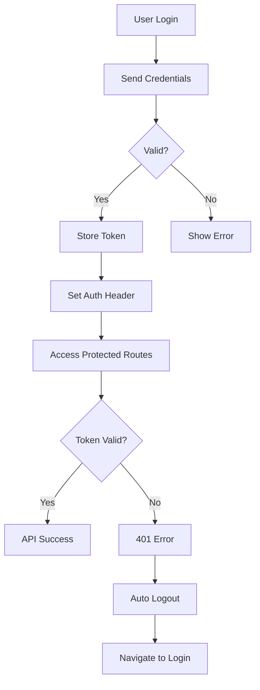

# API Development Guide

> Comprehensive guide for API integration and data management in CMSMobile

## 🚀 Overview

This guide covers the API layer architecture, service implementation patterns, error handling, and best practices for data management in the CMSMobile application.

## 📡 API Architecture

### Service Layer Structure

```
services/api/
├── index.ts              # Main API exports
├── types.ts              # Common API types
├── apiProblem.ts         # Error handling utilities
├── cmsApi.ts            # Main CMS API client
├── i3hostApi.ts         # Secondary API client
└── auth/               # Authentication services
    ├── index.ts        # Auth API methods
    └── types.ts        # Auth-specific types
```

## 🔧 API Client Setup

### Base API Client (CMSApi)

The main API client provides a standardized interface for all HTTP operations:

```typescript
import { CMSApi } from "@/services/api/cmsApi"

// Singleton instance
export const cmsApi = new CMSApi({
  url: Config.API_URL,
  timeout: 30000,
})
```

### Configuration

```typescript
interface ApiConfig {
  url: string // Base API URL
  timeout: number // Request timeout in milliseconds
}

// Environment-based configuration
export const USER_API_CONFIG: ApiConfig = {
  url: Config.API_URL,
  timeout: 30000,
}
```

### API Client Features

1. **Automatic Error Handling**: Built-in 401 interceptors
2. **Type Safety**: Full TypeScript support
3. **Headers Management**: Dynamic header configuration
4. **Request/Response Transformation**: Automatic JSON handling
5. **Navigation Integration**: Auto-redirect on authentication errors

## 🔐 Authentication

### Authentication Flow



### Implementation

```typescript
// Authentication service
export const i3hostLogin = async (): Promise<
  { kind: "ok"; data: ApiLoginResponse } | GeneralApiProblem
> => {
  const response = await i3hostApi.post<ApiLoginResponse>("/auth/login", {
    email: "user@example.com",
    password: "password123",
  })

  if (!response.ok) {
    const problem = getGeneralApiProblem(response)
    if (problem) return problem
  }

  return { kind: "ok", data: response.data }
}

// Set authentication token
cmsApi.setHeader("Authorization", `Bearer ${token}`)
```

### Token Management

```typescript
// Store token in secure storage
import { storage } from "@/utils/storage"

// Save token
await storage.set("authToken", token)

// Retrieve token
const token = await storage.getString("authToken")

// Remove token (logout)
await storage.delete("authToken")
```

## 🛡 Error Handling

### Error Types

```typescript
type GeneralApiProblem =
  | { kind: "timeout"; temporary: true }
  | { kind: "cannot-connect"; temporary: true }
  | { kind: "server" }
  | { kind: "unauthorized" }
  | { kind: "forbidden" }
  | { kind: "not-found" }
  | { kind: "rejected" }
  | { kind: "unknown"; temporary: true }
  | { kind: "bad-data" }
```

### Error Processing

```typescript
import { getGeneralApiProblem } from "@/services/api/apiProblem"

const handleApiResponse = async <T>(
  apiCall: () => Promise<ApiResponse<T>>,
): Promise<{ kind: "ok"; data: T } | GeneralApiProblem> => {
  const response = await apiCall()

  if (!response.ok) {
    const problem = getGeneralApiProblem(response)
    if (problem) return problem
  }

  return { kind: "ok", data: response.data }
}
```

### Automatic 401 Handling

```typescript
// Built into CMSApi class
private setupInterceptors() {
  this.apisauce.addResponseTransform((response) => {
    if (response.status === 401) {
      this.handle401Error()
    }
  })
}

private handle401Error() {
  // Call logout callback
  if (this.logoutCallback) {
    this.logoutCallback()
  }

  // Navigate to login
  if (navigationRef.isReady()) {
    navigationRef.reset({
      index: 0,
      routes: [{ name: "Login" }],
    })
  }
}
```

## 📝 API Service Patterns

### Standard Service Structure

```typescript
// services/api/user/userService.ts
import { cmsApi } from "../cmsApi"
import { GeneralApiProblem, getGeneralApiProblem } from "../apiProblem"
import { User, CreateUserRequest, UpdateUserRequest } from "./types"

export class UserService {
  /**
   * Get user profile
   */
  async getProfile(userId: string): Promise<{ kind: "ok"; user: User } | GeneralApiProblem> {
    const response = await cmsApi.get<User>(`/users/${userId}`)

    if (!response.ok) {
      const problem = getGeneralApiProblem(response)
      if (problem) return problem
    }

    return { kind: "ok", user: response.data }
  }

  /**
   * Create new user
   */
  async createUser(
    userData: CreateUserRequest,
  ): Promise<{ kind: "ok"; user: User } | GeneralApiProblem> {
    const response = await cmsApi.post<User>("/users", userData)

    if (!response.ok) {
      const problem = getGeneralApiProblem(response)
      if (problem) return problem
    }

    return { kind: "ok", user: response.data }
  }

  /**
   * Update user
   */
  async updateUser(
    userId: string,
    updates: UpdateUserRequest,
  ): Promise<{ kind: "ok"; user: User } | GeneralApiProblem> {
    const response = await cmsApi.put<User>(`/users/${userId}`, updates)

    if (!response.ok) {
      const problem = getGeneralApiProblem(response)
      if (problem) return problem
    }

    return { kind: "ok", user: response.data }
  }

  /**
   * Delete user
   */
  async deleteUser(userId: string): Promise<{ kind: "ok" } | GeneralApiProblem> {
    const response = await cmsApi.delete(`/users/${userId}`)

    if (!response.ok) {
      const problem = getGeneralApiProblem(response)
      if (problem) return problem
    }

    return { kind: "ok" }
  }
}

// Export singleton
export const userService = new UserService()
```

### Type Definitions

```typescript
// services/api/user/types.ts
export interface User {
  id: string
  email: string
  firstName: string
  lastName: string
  avatar?: string
  createdAt: string
  updatedAt: string
}

export interface CreateUserRequest {
  email: string
  password: string
  firstName: string
  lastName: string
}

export interface UpdateUserRequest {
  firstName?: string
  lastName?: string
  avatar?: string
}

export interface LoginRequest {
  email: string
  password: string
}

export interface LoginResponse {
  token: string
  user: User
  expiresAt: string
}
```

## 🔄 Integration with MobX Stores

### Store Actions with API Calls

```typescript
// stores/UserStore/actions.ts
import { userService } from "@/services/api/user/userService"
import { withSetPropAction } from "../utils/withSetPropAction"

export const userActions = (self: any) =>
  withSetPropAction(self, {
    async loadProfile(userId: string) {
      self.setLoading(true)
      self.setError(null)

      const result = await userService.getProfile(userId)

      if (result.kind === "ok") {
        self.setUser(result.user)
      } else {
        self.setError(this.getErrorMessage(result))
      }

      self.setLoading(false)
    },

    async updateProfile(updates: UpdateUserRequest) {
      if (!self.user) return

      self.setLoading(true)

      const result = await userService.updateUser(self.user.id, updates)

      if (result.kind === "ok") {
        self.setUser(result.user)
      } else {
        self.setError(this.getErrorMessage(result))
      }

      self.setLoading(false)
    },

    getErrorMessage(problem: GeneralApiProblem): string {
      switch (problem.kind) {
        case "unauthorized":
          return "Authentication required"
        case "forbidden":
          return "Access denied"
        case "not-found":
          return "Resource not found"
        case "server":
          return "Server error occurred"
        case "timeout":
          return "Request timed out"
        case "cannot-connect":
          return "Cannot connect to server"
        case "bad-data":
          return "Invalid response data"
        default:
          return "An unexpected error occurred"
      }
    },
  })
```

## 📊 Data Transformation

### Request Transformation

```typescript
// Transform data before sending to API
const transformUserForApi = (user: LocalUser): ApiUserRequest => ({
  first_name: user.firstName, // camelCase to snake_case
  last_name: user.lastName,
  email_address: user.email,
  profile_image: user.avatar,
})
```

### Response Transformation

```typescript
// Transform API response to local format
const transformUserFromApi = (apiUser: ApiUser): User => ({
  id: apiUser.id,
  firstName: apiUser.first_name, // snake_case to camelCase
  lastName: apiUser.last_name,
  email: apiUser.email_address,
  avatar: apiUser.profile_image,
  createdAt: apiUser.created_at,
  updatedAt: apiUser.updated_at,
})
```

## 🚀 Advanced Patterns

### Request Interceptors

```typescript
// Add request interceptors for common headers
cmsApi.apisauce.addRequestTransform((request) => {
  // Add timestamp to all requests
  request.headers["X-Timestamp"] = new Date().toISOString()

  // Add request ID for tracking
  request.headers["X-Request-ID"] = generateRequestId()
})
```

### Response Caching

```typescript
// Simple in-memory cache
class ApiCache {
  private cache = new Map<string, { data: any; timestamp: number }>()
  private readonly TTL = 5 * 60 * 1000 // 5 minutes

  set(key: string, data: any) {
    this.cache.set(key, { data, timestamp: Date.now() })
  }

  get(key: string): any | null {
    const cached = this.cache.get(key)
    if (!cached) return null

    if (Date.now() - cached.timestamp > this.TTL) {
      this.cache.delete(key)
      return null
    }

    return cached.data
  }

  clear() {
    this.cache.clear()
  }
}

const apiCache = new ApiCache()
```

### Retry Logic

```typescript
// Retry failed requests with exponential backoff
const withRetry = async <T>(
  apiCall: () => Promise<ApiResponse<T>>,
  maxRetries = 3,
  baseDelay = 1000,
): Promise<ApiResponse<T>> => {
  let lastError: any

  for (let attempt = 0; attempt <= maxRetries; attempt++) {
    try {
      const response = await apiCall()

      if (response.ok || !isRetryableError(response)) {
        return response
      }

      lastError = response
    } catch (error) {
      lastError = error
    }

    if (attempt < maxRetries) {
      const delay = baseDelay * Math.pow(2, attempt)
      await new Promise((resolve) => setTimeout(resolve, delay))
    }
  }

  return lastError
}

const isRetryableError = (response: ApiResponse<any>): boolean => {
  return response.status >= 500 || response.problem === "TIMEOUT_ERROR"
}
```

## 🧪 Testing API Services

### Unit Testing

```typescript
// __tests__/services/userService.test.ts
import { userService } from "@/services/api/user/userService"
import { cmsApi } from "@/services/api/cmsApi"

// Mock the API client
jest.mock("@/services/api/cmsApi")
const mockCmsApi = cmsApi as jest.Mocked<typeof cmsApi>

describe("UserService", () => {
  beforeEach(() => {
    jest.clearAllMocks()
  })

  it("should get user profile successfully", async () => {
    const mockUser = { id: "1", name: "John Doe" }
    mockCmsApi.get.mockResolvedValue({
      ok: true,
      data: mockUser,
    } as any)

    const result = await userService.getProfile("1")

    expect(result.kind).toBe("ok")
    if (result.kind === "ok") {
      expect(result.user).toEqual(mockUser)
    }
    expect(mockCmsApi.get).toHaveBeenCalledWith("/users/1")
  })

  it("should handle API errors", async () => {
    mockCmsApi.get.mockResolvedValue({
      ok: false,
      status: 404,
      problem: "CLIENT_ERROR",
    } as any)

    const result = await userService.getProfile("1")

    expect(result.kind).toBe("not-found")
  })
})
```

### Integration Testing

```typescript
// Test store + service integration
import { setupRootStore } from "@/stores/utils/setupRootStore"

describe("User Store Integration", () => {
  let rootStore: any

  beforeEach(async () => {
    rootStore = await setupRootStore()
  })

  it("should load user profile", async () => {
    // Mock API response
    mockCmsApi.get.mockResolvedValue({
      ok: true,
      data: { id: "1", name: "John Doe" },
    } as any)

    await rootStore.userStore.loadProfile("1")

    expect(rootStore.userStore.user).toBeTruthy()
    expect(rootStore.userStore.loading).toBe(false)
    expect(rootStore.userStore.error).toBe(null)
  })
})
```

## 📋 Best Practices

### 1. Consistent Error Handling

- Always use the `GeneralApiProblem` type for error handling
- Provide user-friendly error messages
- Handle temporary vs permanent errors appropriately

### 2. Type Safety

- Define TypeScript interfaces for all API requests and responses
- Use generic types for reusable patterns
- Validate response data structure

### 3. Performance

- Implement caching for frequently accessed data
- Use request deduplication for identical concurrent requests
- Implement proper loading states

### 4. Security

- Never store sensitive data in API clients
- Use secure storage for tokens
- Implement proper logout procedures

### 5. Monitoring

- Log API calls in development mode
- Track API performance metrics
- Monitor error rates and response times

## 🔍 Debugging

### Development Tools

```typescript
// Enable API logging in development
if (__DEV__) {
  import("reactotron-apisauce").then(({ trackApiCalls }) => {
    trackApiCalls(cmsApi.apisauce)
  })
}
```

### Common Issues

1. **CORS Errors**: Configure server CORS headers properly
2. **Timeout Issues**: Adjust timeout values for slower networks
3. **Authentication Loops**: Ensure proper 401 handling
4. **Memory Leaks**: Clean up subscriptions and listeners

This guide provides a comprehensive foundation for API development in CMSMobile, ensuring consistent, type-safe, and maintainable API integration patterns.
