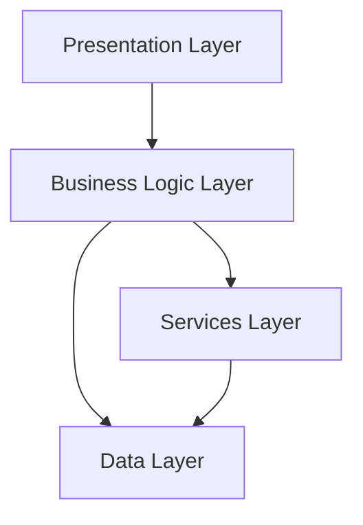
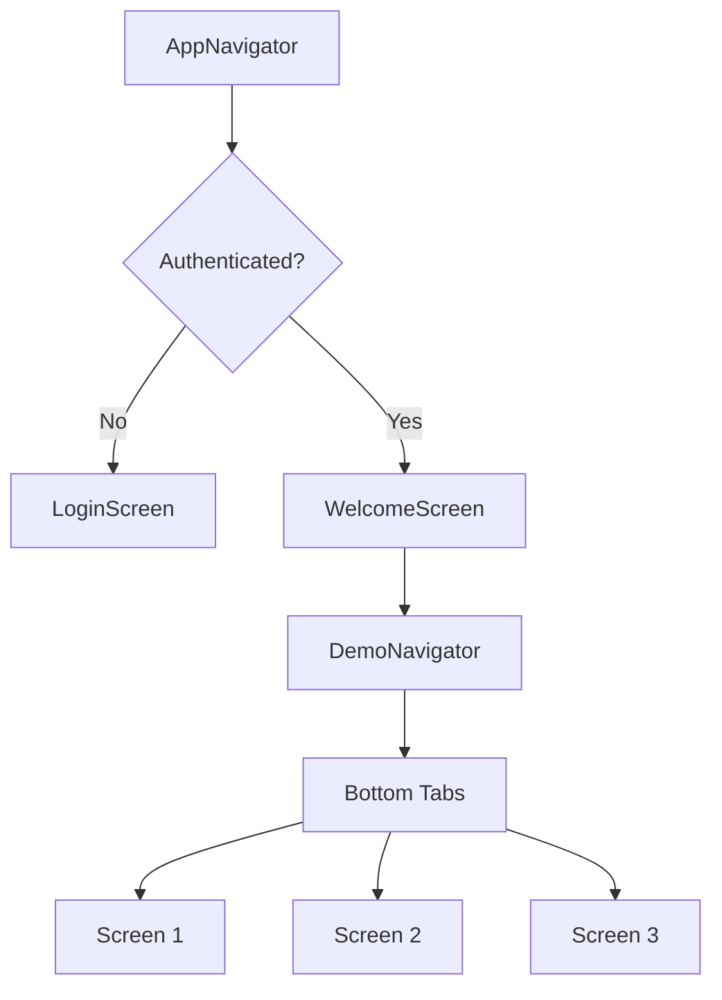
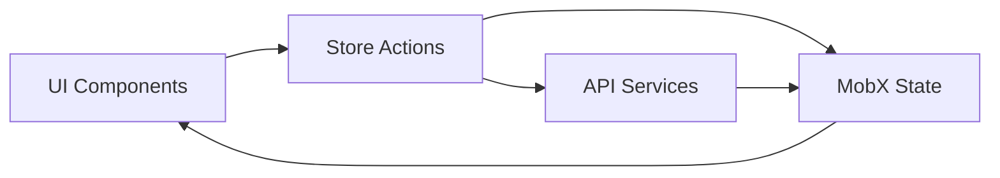

# Architecture Guide

> Comprehensive overview of CMSMobile's system architecture, patterns, and design decisions

## 🏗 Overview

CMSMobile follows a layered architecture pattern with clear separation of concerns, providing a scalable and maintainable codebase for React Native applications.

## 📐 Architecture Patterns

### Layered Architecture



### Core Layers

1. **Presentation Layer** (`app/screens`, `app/components`)
   - React Native components and screens
   - UI rendering and user interactions
   - Navigation between screens

2. **Business Logic Layer** (`app/stores`)
   - MobX-State-Tree stores
   - Application state management
   - Business rules and workflows

3. **Services Layer** (`app/services`)
   - API communication
   - External service integrations
   - Data transformation

4. **Data Layer** (`app/utils/storage`)
   - Local data persistence
   - Cache management
   - Data access utilities

## 🏪 State Management with MobX-State-Tree

### Store Architecture

```
stores/
├── RootStore.ts           # Main store composition
├── UserStore/            # User domain store
│   ├── User/            # User models
│   ├── Auth/           # Authentication logic
│   └── index.ts        # Store composition
└── utils/              # Store utilities
    ├── useStores.ts    # Store hooks
    ├── getRootStore.ts # Store access
    └── setupRootStore.ts # Store initialization
```

### Store Composition Pattern

```typescript
// Example store structure
export const RootStore = types
  .model("RootStore")
  .props({
    userStore: types.optional(UserStore, {}),
    // Additional stores...
  })
  .actions((self) => ({
    // Root-level actions
  }))
```

### Best Practices

- **Modular Design**: Each domain has its own store directory
- **Type Safety**: Full TypeScript integration with MST
- **Separation of Concerns**: Clear boundaries between stores
- **Performance**: Optimized reactivity with MobX observers

## 🧭 Navigation Architecture

### Navigation Structure

```
navigators/
├── AppNavigator.tsx      # Main app navigation
├── DemoNavigator.tsx     # Feature-specific navigation
├── linking.ts           # Deep linking configuration
└── navigationUtilities.ts # Navigation helpers
```

### Navigation Flow



### Type-Safe Navigation

```typescript
// Navigation parameter types
export type AppStackParamList = {
  Welcome: undefined
  Login: undefined
  Demo: NavigatorScreenParams<DemoTabParamList>
}

// Usage with type safety
const navigation = useNavigation<NavigationProp<AppStackParamList>>()
navigation.navigate("Demo", { screen: "Community" })
```

## 🎨 Theming System

### Theme Architecture

```
theme/
├── theme.ts             # Main theme definitions
├── colors.ts            # Color system
├── colorsDark.ts        # Dark theme colors
├── typography.ts        # Typography scale
├── spacing.ts           # Spacing system
├── timing.ts            # Animation timing
├── context.tsx          # Theme provider
└── types.ts             # Theme type definitions
```

### Theme Structure

```typescript
interface Theme {
  colors: ColorScheme
  spacing: SpacingScale
  typography: TypographyScale
  timing: TimingScale
  isDark: boolean
}
```

### Theme Provider Pattern

```typescript
// Theme context usage
const { theme, setTheme, isDark } = useAppTheme()

// Component with theme
const ThemedComponent = () => {
  const { theme } = useAppTheme()
  return (
    <View style={{ backgroundColor: theme.colors.background }}>
      {/* Content */}
    </View>
  )
}
```

## 🧩 Component Architecture

### Component Hierarchy

```
components/
├── ui/                  # Base UI components
│   ├── Button.tsx      # Styled button component
│   ├── Text.tsx        # Typography component
│   ├── Input.tsx       # Form input component
│   └── index.ts        # Barrel exports
├── AutoImage.tsx       # Image handling component
├── Header.tsx          # Screen header component
├── Icon.tsx            # Icon component
├── ListItem.tsx        # List item component
└── Screen.tsx          # Screen wrapper component
```

### Component Design Principles

1. **Composition over Inheritance**: Use composition patterns for flexibility
2. **Prop-based Styling**: Use variants and props for styling control
3. **Type Safety**: Full TypeScript support with proper interfaces
4. **Accessibility**: Built-in accessibility features
5. **Performance**: Optimized rendering with React.memo where needed

### Base Component Pattern

```typescript
// Example base component with variants
interface ButtonProps extends PressableProps {
  variant?: 'default' | 'secondary' | 'destructive'
  size?: 'sm' | 'default' | 'lg'
  text?: string
  children?: React.ReactNode
}

export const Button: React.FC<ButtonProps> = ({
  variant = 'default',
  size = 'default',
  text,
  children,
  ...props
}) => {
  // Component implementation with class-variance-authority
  return (
    <Pressable className={cn(buttonVariants({ variant, size }))} {...props}>
      {children || <Text>{text}</Text>}
    </Pressable>
  )
}
```

## 📡 API & Services Architecture

### Service Layer Structure

```
services/
├── api/
│   ├── cmsApi.ts        # Main API client
│   ├── i3hostApi.ts     # Secondary API client
│   ├── apiProblem.ts    # Error handling
│   ├── types.ts         # API type definitions
│   └── auth/           # Authentication services
│       ├── index.ts    # Auth API methods
│       └── types.ts    # Auth types
└── index.ts            # Service exports
```

### API Client Pattern

```typescript
// Type-safe API client with apisauce
class CmsApi {
  private api: ApisauceInstance

  constructor(config: ApiConfig) {
    this.api = create({
      baseURL: config.url,
      timeout: config.timeout,
    })
  }

  async login(credentials: LoginRequest): Promise<ApiResponse<LoginResponse>> {
    const response = await this.api.post("/auth/login", credentials)
    return this.handleResponse(response)
  }
}
```

## 🌐 Internationalization

### i18n Structure

```
i18n/
├── index.ts            # i18n configuration
├── translate.ts        # Translation utilities
├── en.ts              # English translations
├── fr.ts              # French translations
├── demo-en.ts         # Demo English translations
└── demo-fr.ts         # Demo French translations
```

### Translation Usage

```typescript
// Using translations in components
import { translate } from "@/i18n"

const MyComponent = () => {
  return (
    <Text tx="common.welcome" />
    // or
    <Text text={translate("common.welcome")} />
  )
}
```

## 🔧 Configuration Management

### Config Structure

```
config/
├── index.ts           # Config composition
├── config.base.ts     # Base configuration
├── config.dev.ts      # Development config
└── config.prod.ts     # Production config
```

### Environment-based Configuration

```typescript
// Environment-specific settings
const Config = {
  ...BaseConfig,
  ...(__DEV__ ? DevConfig : ProdConfig),
}

// Usage in application
if (Config.enableReactotron) {
  // Development-only code
}
```

## 🧪 Testing Architecture

### Test Structure

```
test/
├── setup.ts           # Test setup and configuration
├── mockFile.ts        # Mock implementations
└── __tests__/        # Test files
    ├── components/   # Component tests
    ├── stores/      # Store tests
    └── services/    # Service tests
```

### Testing Patterns

1. **Unit Tests**: Jest for individual component/function testing
2. **Integration Tests**: Testing component + store interactions
3. **E2E Tests**: Maestro for full user flow testing
4. **Snapshot Tests**: UI consistency testing

## 📱 Platform-Specific Architecture

### Cross-Platform Strategy

```typescript
// Platform-specific implementations
import { gestureHandler } from "./gestureHandler"
// Uses .native.ts or .web.ts extensions for platform-specific code

// Conditional rendering
if (Platform.OS === "ios") {
  // iOS-specific implementation
} else if (Platform.OS === "android") {
  // Android-specific implementation
}
```

## 🔄 Data Flow

### Unidirectional Data Flow



### State Update Pattern

1. **User Interaction** → Component triggers action
2. **Store Action** → Modifies MobX state
3. **State Change** → Triggers reactive updates
4. **Component Re-render** → UI reflects new state

## 🏗 Build Architecture

### Build Configuration

- **Metro Bundler**: JavaScript bundling and transformation
- **EAS Build**: Cloud-based native builds
- **TypeScript**: Compile-time type checking
- **ESLint/Prettier**: Code quality and formatting

### Asset Management

```
assets/
├── icons/            # SVG and PNG icons
└── images/          # Application images
```

## 📊 Performance Considerations

### Optimization Strategies

1. **Lazy Loading**: Code splitting for screens and components
2. **Memoization**: React.memo for expensive components
3. **List Optimization**: FlashList for large data sets
4. **Bundle Size**: Tree shaking and code elimination
5. **Memory Management**: Proper cleanup in useEffect hooks

### Monitoring

- **Reactotron**: Development-time debugging
- **Performance Monitoring**: Built-in React Native performance tools
- **Crash Reporting**: Centralized error tracking

This architecture provides a solid foundation for building scalable React Native applications with clear patterns and best practices.
